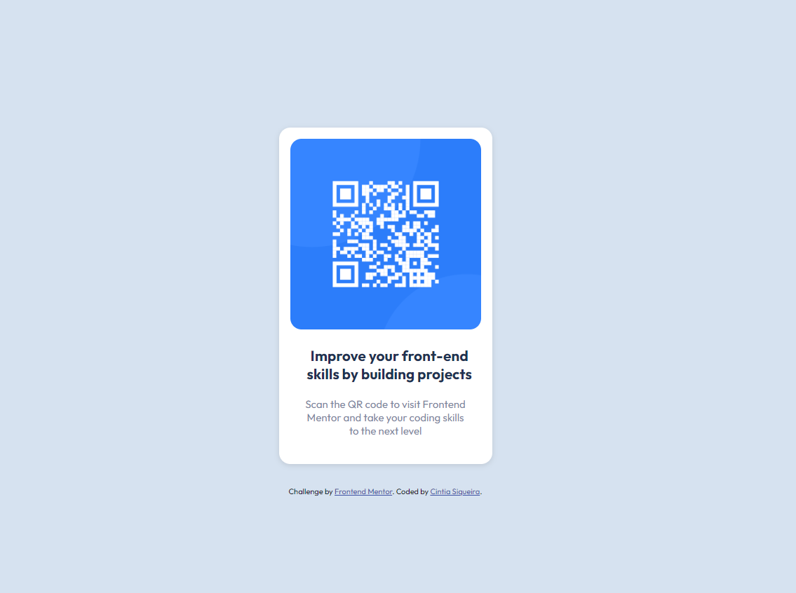

# Frontend Mentor - QR code component solution

This is a solution to the [QR code component challenge on Frontend Mentor](https://www.frontendmentor.io/challenges/qr-code-component-iux_sIO_H). Frontend Mentor challenges help you improve your coding skills by building realistic projects.

## Table of contents

- [Overview](#overview)
  - [Screenshot](#screenshot)
  - [Links](#links)
- [My process](#my-process)
  - [Built with](#built-with)
  - [What I learned](#what-i-learned)
  - [Continued development](#continued-development)
  - [Useful resources](#useful-resources)
- [Author](#author)
- [Acknowledgments](#acknowledgments)

## Overview

### Screenshot



### Links

- Solution URL: [Solution URL here](https://github.com/ciisiq/challenge-QR-code-component)
- Live Site URL: [Live site URL here](https://your-live-site-url.com)

## My process

### Built with

- HTML5
- CSS
- Flexbox
- Mobile-first

### What I learned

I used all the feedback I got from my last submit and try to apply here so I learned about the landmark that I need to put and roles, the importance about to use rem in text.

```html
<main role="main">Main tag</main>
```

```css
.description {
  font-size: 0.938rem;
```

### Continued development

I need to learn more about accebility, the most feedbacks I had was about tags and for people with disability, I was not expected this but I was very happy to read and improve.

### Useful resources

- [Landmark](https://dequeuniversity.com/rules/axe/4.3/landmark-one-main?application=axeAPI) - This helped me with tha landmark

## Author

- Website - [Cintia Siqueira](https://cisiq.dev/)
- Frontend Mentor - [@yciisiq](https://www.frontendmentor.io/profile/ciisiq)
- Twitter - [@cii_siq](https://twitter.com/Cii_siq)

## Acknowledgments

To be afraid to get negative feedbacks it will help you a lot if you take in the positive way.
